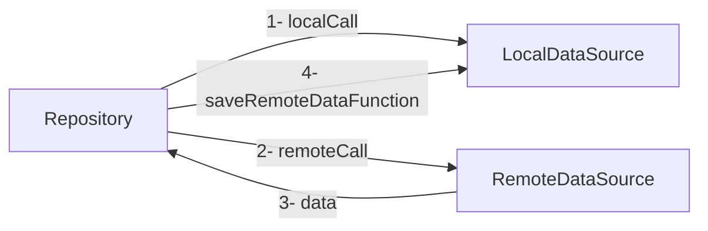

# Folder Structure
	- lib
	
		|---- datasource
		|		|
		|		|--- local_data_soruce
		|		|		|
		|		|		|-- i_base_local_data_source.dart
		|		|		|
		|		|		|-- base_local_data_source.dart
		|		|		|
		|		|--- remote_data_source
		|		|		|
		|		|		|-- i_base_remote_data_source.dart
		|		|		|
		|		|		|-- base_remote_data_source.dart
		|		|		|
		|		|--- shared_preferences_data_source
		|		|		|
		|		|		|-- i_base_shared_preferences.dart
		|		|		|
		|		|		|-- base_shared_preferences.dart
		|		|
		|---- repository
		|		|
		|		|--- base_repository.dart
		|		|
		|		|--- common_app_repository.dart
		|
		|---- presentation
		|		|
		|		|--- mixins
		|		|		|
		|		|		|-- bloc_builder_mixin.dart
		|		|		|
		|		|		|-- bloc_consumer_mixin.dart
		|		|		|
		|		|		|-- bloc_listener_mixin.dart
		|		|		|
		|		|		|-- bloc_provider_mixin.dart
		|		|		|
		|		|		|-- search_mixin.dart
		|		|		|
		|		|		|-- size_mixin.dart
		|		|		|
		|		|		|-- theme_mixin.dart
		|		|
		|		|--- widgets
		|		|		|
		|		|		|-- base_bloc_page.dart
		|		|		|
		|		|		|-- base_state_widget.dart
		|		|		|
		|		|		|-- bloc_helper_widget.dart
		|		|		|
		|		|		|-- bloc_state_getit.dart
		|		|		|
		|		|		|-- bloc_state_provider.dart
		|		|
		|---- state_mangement
		|		|
		|		|--- bloc_state_mangement
		|		|		|
		|		|		|-- base_bloc.dart
		|		|		|
		|		|		|--- helper_bloc
		|		|		|
		|		|		|	|-- helper_bloc.dart
		|		|		|	|
		|		|		|	|-- helper_state.dart
		|		|		|	|
		|		|		|	|-- helper_event.dart
		|		|
		|---- utils
		|		|
		|		|--- data_model_wrapper.dart
		|		|
		|		|--- token_constants.dart
		|		|
		|		|--- extensions
		|		|		|
		|		|		|-- double_ext.dart
		|		|		|
		|		|		|-- int_ext.dart
		|		|		|
		|		|		|-- map_ext.dart
		|		|		|
		|		|		|-- string_ext.dart
		|		|
		|		|--- failures
		|		|		|
		|		|		|-- base_failure.dart
		|		|		|
		|		|		|-- local_failures.dart
		|		|		|
		|		|		|-- network_failures.dart
		|		|
		|		|--- interceptors
		|		|		|
		|		|		|-- json_decoder_interceptor.dart
		|		|		|
		|		|		|-- token_interceptor.dart
		|		|
		|---- constant.dart
		|
		|---- type_defs.dart

# Data

1. Failures:
    - BaseFailure:

      > Base failure class which every failure must implement, has one property to 		    override which is **failureMessage**
   ---
    - LocalFailure:

      > This failure will return from local data source, has 2 type:
      **CustomFailure**  with message property, **UknownError** with Object the error object.
   ---
    - NetworkFailure:

      > This Failure will return from remote data source, has six types, all of these failures has an optional **message** property:
      **ServerFailure** will return if  status code of the request > **500**.
      **RequestCancelled** will return if the request got cancelled.
      **NoInternetFailure** will return if the request gets failed because of the user internet.
      **UnauthenticatedFailure** will return if status code of the request **400** or **401**
      **CustomFailure** will return if there is something wrong with the response.
      **UnknownError** will return if something went wrong, ex: error parsing json, casting error, etc…
   ---

2. DataModelWrapper:

   > This object will wrap every returned object has four types:
   **NetworkData** has an object of type **T** coming from remote server.
   **LocalData** has an object of type **T** coming from local database.
   **NetworkDataFailure** has a failure of type **NetworkFailure** coming from remote server.
   **LocalDataFailure** has a failure of type **LocalFailure** coming from local database.

# Datasource

- BaseRemoteDataSource:

    - Deserializer

      > `T Function(Object?)` how to parse the json to an object.

    - Future<DataModelWrapper<T>> request<T>

      > This function will make the Http request, parse the response and return DataModelWrapper based on http response.

    - failureParser(Response response)

      > Return failure String base on response.

    - defaultErrorMessage

      > The default message inside failures, if couldn't **failureParser** return null.

    - wrapBodyWithBaseRequest(data)

      > wrap requsted body with base request.

---

- BaseLocalDataSource:

    - DatabaseSchema:

      > List of string contains SQL create queries.

    - SqlQuery:

      > Tuple2<String, List<dynamic>>   item1 is the where statement, item2 is the args of where statement. ex: item1 = 'columnId = ?' , item2 = [10].

    - BaseLocalDataSource.fromDataBase

      > Named construct to Initialize **BaseLocalDataSource**.

    - deleteObject:

      > delete object from database.

    - updateObject:

      > update object inside database.

  - insertObject:

    > insert object in database.

---

- BaseSharedPreferences:

  > Implemation for **sharedPreferences** functions.

# Repository

- BaseRepository:

    - Future<DataModelWrapper<T>> requestData<T>

      > This function will wrap calls going to datasource layer, and will manage getting the data either from remote server or local data base, and caching the result in **localdatabase**.

# Statemangment

- HelperBloc

  > This bloc will provide three main functionallty:
  1- **PageLoading**. 2- **ErrorHandling**. 3- Providing **BuildContext** to your bloc.

- BaseBloc:

  > `void runFunctionWithContext(ContextCallback contextCallback)`
  This function will provide **BuildContext**.

  > **Future<DataModelWrapper<T>> futureWrapper** :
  this function will wrap your future call and manage the page loading and displaying error message.

# Presentation

- Mixins
  - 
    - SizeMixin:

      > Will provide main size property for your state class.

    - ThemeMixin:

      > Will provide main theme property for your state class.

    - SearchMixin:

      > Will provide main search functionallty for your state class.

    - BlocProvidersMixin:

      > Will inject a **BlocProvider** above your state class.

    - BlocListenerMixin:

      > Will inject a **BlocListener** above your state class.

    - BlocConsumerMixin:

      > Will inject a **BlocConsumer** above your state class.

    - BlocBuilderMixin:

      > Will inject a **BlocBuilder** above your state class.

---

- Widgets

    - BaseState

      > Will provide **ThemeMixin** & **SizeMixin**.

    - BlocStateGetIt

      > Will provide instance of **Bloc** from **GetIt**.

    - BlocStateProvider

      > Will provide instance of **Bloc** by using **BlocProvider**

    - BaseBlocPageState

      > `Widget onLoading()` this will return app loading page when **HelperBloc**  `isLoading = true`.
      > `Widget onFailure(BaseFailure failure)` this will return Failure widget when **HelperBloc** `failure != null`.
      > `Widget buildChild(BuildContext context)` this will return child widget when every thing is ok with helper bloc.

# Interceptors

- TokenInterceptor

  > Helper interceptor to inject the authentication token in the request.

- JsonDecoderInterceptor

  > Helper interceptor to convert the json from **String** to **Map<String, dyanmic>**
 